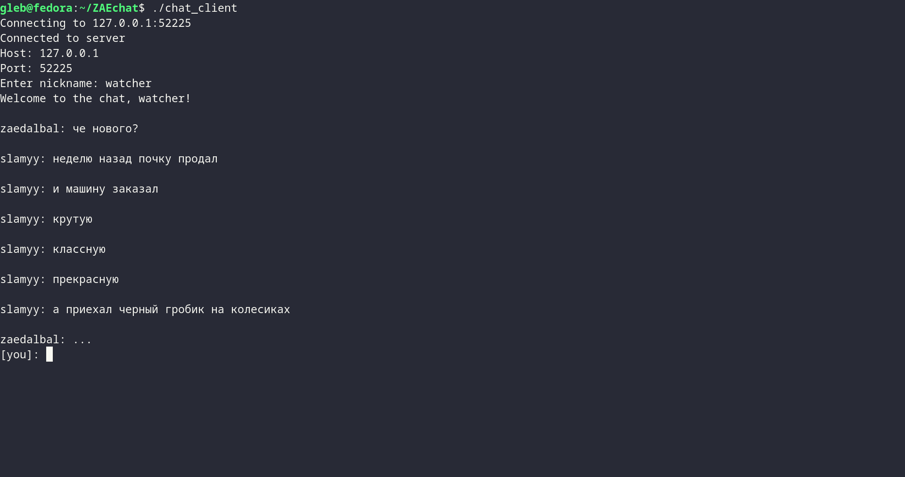

# TCP Chat Server

Простой многопользовательский чат-сервер на C++ с использованием Boost.Asio

# Screenshots



## Описание

Асинхронный TCP-сервер для обмена сообщениями между клиентами в реальном времени

## Требования

- C++20 (для корутин)
- Boost.Asio
- g++ или другой компилятор

## Сборка

```bash
make all
```

Отдельная сборка:

```bash
make server
make client
```

## Запуск

Запуск сервера:

```bash
./chat_server [port]
```

По умолчанию используется порт 52225

Запуск клиента:

```bash
./chat_client [host] [port]
```

По умолчанию подключение к localhost:52225

## Использование

После подключения клиент запрашивает никнейм. Разрешены только буквы, цифры, дефисы и подчеркивания. Если никнейм уже занят, к нему автоматически добавляется номер

Команды клиента:

/quit или /exit - отключение от сервера

## Очистка

```bash
make clean
```

## Проблемы которые имеются на данный момент

Есть проблемы с приглашением ввода и вводимым текстом (вводимый текст стироается, если приходит сообщение)
В будущем постараюсь исправить с помощью каких-нибудь библиотек или сделаю ui